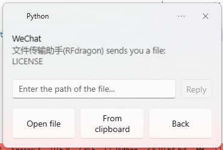

# Ramox

Language: [Simplified Chinese](README.md) | English

## Project introduction

This project is based on `wxpy` and `win11toast`. It is a WeChat helper that sends all WeChat messages received to Windows 11 notification center.

### Project features

- Concise, pretty, light-weighted
- Quick and convenient replication to messages received
- Highly customizable, can implement functions like auto replying and auto accepting friend requests by modifying the code a little bit

### Functions supported

- Receive and display text messages
- Receive and display images
- Receive files, display file names, one-click opening files
- Videos and recordings are dealt the same way as files

### Functions to be implemented

- One-click playing recordings
- Quickly send files, images and videos

### Functions not currently planned to implement

- UI
- Displaying history messages
- Sending or receiving name cards, money transfer and maps
- Moment

### Effect

- Text messages


- Images


- Files



### Notice

The program can only be used for learning purpose, it should NOT be used for commercial purposes. Abuse of this program might lead to violation of Agreement on Software License and Service of Tencent Weixin. Please only use this program according to the agreement. We will not be responsible of any legal consequences brought by violation of Agreement on Software License and Service of Tencent Weixin.

## Development environment

- Windows 11 25330.1000
- Python 3.8

Not tested in other systems or environments. A successful deploying is not guaranteed.

## Installation

1. Install [Python](https://www.python.org/).
2. Install all required packages:
```bash
pip install -r requirements.txt
```

## Run

Simply run by double clicking [run.bat](run.bat).

## Acknowledgements

- [wxpy](https://github.com/youfou/wxpy)
- [win11toast](https://github.com/GitHub30/win11toast)