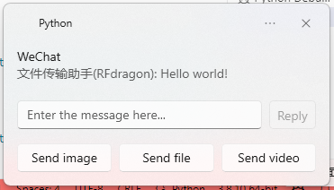

# Ramox

Language: [Simplified Chinese](README.md) | English

## Project introduction

This project is based on `wxpy` and `win11toast`. It is a WeChat helper that sends all WeChat messages received to the Windows 11 notification center.

### Project features

- Concise, pretty, light-weighted
- Quick and convenient replication of messages received
- Highly customizable, can implement functions like auto replying and auto accepting friend requests by modifying the code a little bit

### Functions supported

- Receive and display text messages
- Receive and display images
- Receive files, display file names, one-click opening files
- Videos and recordings are dealt the same way as files

### Functions to be implemented

- One-click playing recordings
- Quickly send files, images, and videos

### Functions not currently planned to implement

- UI
- Displaying history messages
- Sending or receiving name cards, money transfers, and maps
- Moment

### Effect

- Text messages



- Images


- Files


### Notice

The program can only be used for learning purposes, it should NOT be used for commercial purposes. Abuse of this program might lead to a violation of the Agreement on Software License and Service of Tencent Weixin. Please only use this program according to the agreement. We will not be responsible for any legal consequences brought by the violation of the Agreement on Software License and Service of Tencent Weixin.

## Development environment

- Windows 11 25330.1000
- Python 3.8

Not tested in other systems or environments. A successful deployment is not guaranteed.

## Installation

1. Install [Python](https://www.python.org/).
2. Install all required packages:
```bash
pip install -r requirements.txt
```

## Run

Simply run by double clicking [run.bat](run.bat). After running, all messages will be sent to the Windows notification center in a pretty form. You can reply to those messages in notification boxes conveniently or manually send messages in the terminal.

### Operate with Windows terminal

Detailed function description can be viewed in [server.py](server.py).

#### Show the current chat

```python
def show_context() -> None:...
```
Example:
```bash
In [1]: show_context()
Current context: [文件传输助手].
```

#### Switch to another chat

```python
def switch_context(chat: Union[str, None] = None) -> None:...
```
Example:
```bash
In [2]: switch_context('RFdragon')

In [3]: show_context()
Current context: [RFdragon].
```

#### Send a message to a chat

```python
def send(msg: str, chat: Union[str, None] = None, msg_type: str = 'msg') -> None:
```
Example:
```bash
In [4]: send('Hello world!', chat='RFdragon')
```

## Acknowledgements

- [wxpy](https://github.com/youfou/wxpy)
- [win11toast](https://github.com/GitHub30/win11toast)
