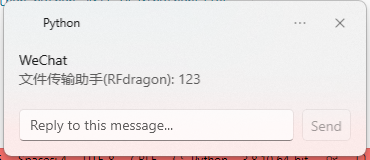
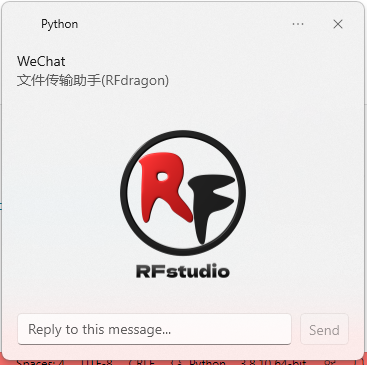
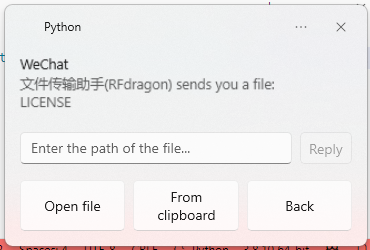
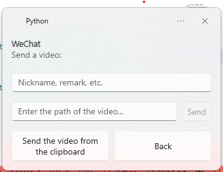

# Ramox

语言：简体中文 | [English](README.en.md)

## 项目介绍

本项目为一个基于`wxpy`和`win11toast`的将微信转发到Windows 11通知中心并支持快捷回复的微信机器人。

### 项目特点

- 简洁、美观、轻量化
- 方便、快捷的回复
- 可自定义程度高，只要稍微修改代码即可实现自动回复、自动通过好友请求等功能

### 支持功能

- 接收并显示文字消息
- 接收并显示图片
- 接收文件、显示文件名、一键打开文件
- 快速回复文字、图片、文件或视频
- 使用`Ctrl+Alt+W`主动呼出通知中心弹窗发送消息
- 视频、语音等消息均按照文件处理

### 待开发功能

- 一键播放语音
- 显示历史消息记录

### 暂不计划开发

- 图形用户界面
- 名片、转账、地图等消息的收发
- 朋友圈

### 效果展示

- 回复文字消息



- 回复图片



- 回复文件



- 主动发送视频



### 注意事项

本程序仅供学习用途使用，不得用于商业用途。对本程序的滥用可能违反腾讯微信软件许可及服务协议，请遵循协议使用。本人不承担由于使用本程序而违反腾讯微信软件许可及服务协议所带来的法律责任。

## 开发环境

- Windows 11 25330.1000
- Python 3.8

暂未在其他系统及环境中运行测试，不保证能够运行。

## 安装

1. 安装[Python](https://www.python.org/)。
2. 安装所有依赖的包：
```bash
pip install -r requirements.txt -i https://pypi.tuna.tsinghua.edu.cn/simple
```

## 使用方法

双击[run.bat](run.bat)即可开始运行。运行后，所有信息会以美观的形式被转发到Windows通知中心。你可以在收到通知时快捷地进行回复，使用`Ctrl+Alt+W`呼出一个通知中心弹窗并主动发送消息。

## 致谢

- [keyboard](https://github.com/boppreh/keyboard)
- [pyperclip](https://github.com/asweigart/pyperclip)
- [pywin32](https://github.com/mhammond/pywin32)
- [win11toast](https://github.com/GitHub30/win11toast)
- [wxpy](https://github.com/youfou/wxpy)

# 更新日志

## 2023.9.8

- 将CSDN教程版本移动至`tutorial`分支。
- 添加了快捷回复图片、文件和视频的功能。
- 添加了主动呼出菜单并发送消息的功能。
- 现在可以直接发送剪贴板中的图片和文件了。
- 删除了使用命令行发送消息的功能。它们已经被主动呼出菜单替代了。